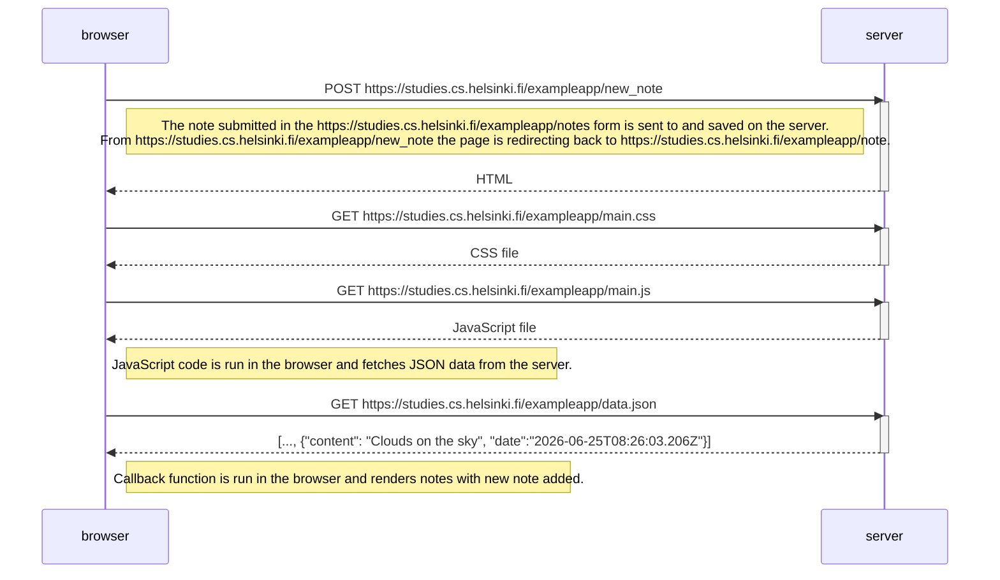

```mermaid
sequenceDiagram
    participant browser
    participant server

    browser->>server: POST https://studies.cs.helsinki.fi/exampleapp/new_note
    activate server

    Note right of browser: The note submitted in the https://studies.cs.helsinki.fi/exampleapp/notes form is sent to and saved on the server. <br>From https://studies.cs.helsinki.fi/exampleapp/new_note the page is redirecting back to https://studies.cs.helsinki.fi/exampleapp/note. 

    server-->> browser: HTML
    deactivate server

    browser->>server: GET https://studies.cs.helsinki.fi/exampleapp/main.css
    activate server
    server-->>browser: CSS file
    deactivate server

    browser->>server: GET https://studies.cs.helsinki.fi/exampleapp/main.js
    activate server
    server-->>browser: JavaScript file
    deactivate server

    Note right of browser: JavaScript code is run in the browser and fetches JSON data from the server.

    browser->>server: GET https://studies.cs.helsinki.fi/exampleapp/data.json
    activate server
    server-->>browser: [..., {"content": "Clouds on the sky", "date":"2026-06-25T08:26:03.206Z"}] 
    deactivate server

    Note right of browser: Callback function is run in the browser and renders notes with new note added.
```