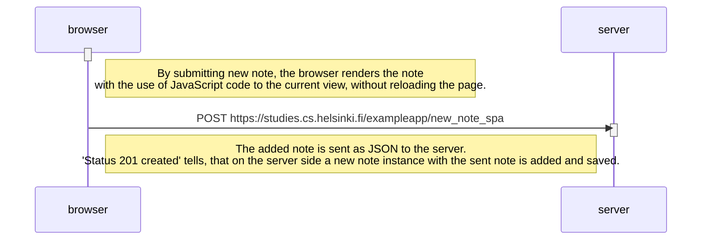

```mermaid
sequenceDiagram
    participant browser
    participant server 
    
    activate browser
    deactivate browser

    Note right of browser: By submitting new note, the browser renders the note <br>with the use of JavaScript code to the current view, without reloading the page.

    browser->>server: POST https://studies.cs.helsinki.fi/exampleapp/new_note_spa
    activate server
    deactivate server

    Note right of browser: The added note is sent as JSON to the server. <br>'Status 201 created' tells, that on the server side a new note instance with the sent note is added and saved. 
```